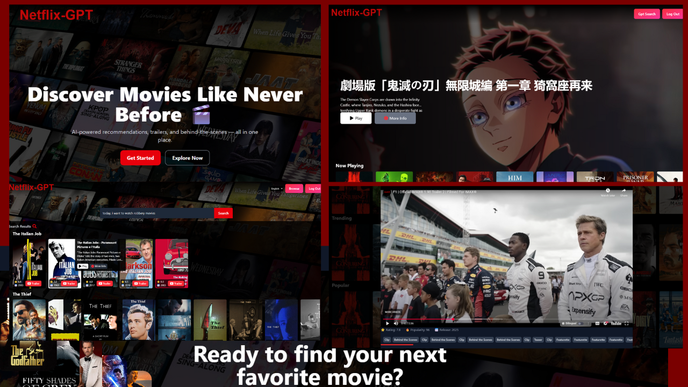

 
---

# 🎬 Project: Netflix GPT

## 📘 Overview

A modern streaming web app combining a Netflix-style interface with AI-powered movie recommendations. Built using **React**, **Vite**, and **Tailwind CSS**, with **Firebase** for authentication and APIs from **TMDB** and **OpenAI (Groq)** for intelligent movie suggestions.

---

## ⚙️ How It Works

1. **Login/Sign-up:** Secure authentication via **Firebase**.
2. **Browse Movies:** Dynamic UI with trailers and categorized lists fetched from **TMDB API**.
3. **AI Search:** Users enter natural language queries (e.g., “best sci-fi films from the 90s”).
4. **AI Recommendations:** **Groq API** processes the query and returns matching titles; detailed info fetched from TMDB.
5. **Session Security:** Authenticated routes protect user data and redirect on logout or expiry.

---

## 🧠 Key Learnings

### Frontend (React)

* **Component-based architecture** and **Redux Toolkit** for scalable state management.
* **React Router** for protected SPA navigation.
* **Custom hooks** for cleaner API logic and **useRef** for DOM control.

### Styling

* **Tailwind CSS** for responsive UI.
* Used **Framer Motion** and **React Modal** for animations and interactivity.

### Backend-as-a-Service

* **Firebase Auth** for full user session handling without a custom backend.

### API Integration

* Integrated **TMDB** and **OpenAI** APIs for real-time movie data and AI-driven recommendations.

### Best Practices

* Secured API keys via `.env` files.
* Applied **memoization** for performance optimization.

---

## 🖼️ UI Preview

Below is a preview of the app interface:

 

---

